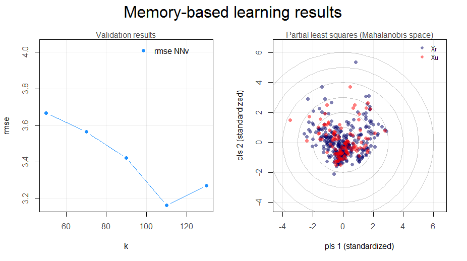

# `resemble` Memory-Based Learning in Spectral Chemometrics

<!-- badges: start -->

<!-- badges: end -->

*Last update: 2025-10-17*

Version: 2.2.5 – dstatements

<em>

Think Globally, Fit Locally (Saul and Roweis, 2003)

</em>

## About

The `resemble` package provides high-performing functionality for
data-driven modeling (including local modeling), nearest-neighbor search
and orthogonal projections in spectral data.

## Vignette

A new vignette for `resemble` explaining its core functionality is
available at:
<https://cran.r-project.org/package=resemble/vignettes/resemble.html>

## Core functionality

The core functionality of the package can be summarized into the
following functions:

**`mbl`**: implements memory-based learning (MBL) for modeling and
predicting continuous response variables. For example, it can be used to
reproduce the famous LOCAL algorithm proposed by Shenk et al. (1997). In
general, this function allows you to easily customize your own MBL
regression-prediction method.

**`dissimilarity`**: Computes dissimilarity matrices based on various
methods (e.g. Euclidean, Mahalanobis, cosine, correlation, moving
correlation, Spectral information divergence, principal components
dissimilarity and partial least squares dissimilarity).

**`ortho_projection`**: A function for dimensionality reduction using
either principal component analysis or partial least squares (a.k.a
projection to latent structures).

**`search_neighbors`**: A function to efficiently retrieve from a
reference set the k-nearest neighbors of another given dataset.

## New version

During the recent lockdown we invested some of our free time to come up
with a new version of our package. This new `resemble` 2.0 comes with
MAJOR improvements and new functions! For these improvements major
changes were required. The most evident changes are in the function and
argument names. These have been now adapted to properly follow the
[tydiverse style guide](https://style.tidyverse.org/). A number of
changes have been implemented for the sake of computational efficiency.
These changes are documented in `inst\changes.md`.

New interesing functions and fucntionality are also available, for
example, the `mbl()` function now allows sample spiking, where a set of
reference observations can be forced to be included in the
neighborhhoods of each sample to be predicted. The `serach_neighbors()`
function efficiently retrieves from a refence set the k-nearest
neighbors of another given dataset. The `dissimilarity()` function
computes dissimilarity matrices based on various metrics.

## Installation

If you want to install the package and try its functionality, it is very
simple, just type the following line in your `R` console:

    install.packages('resemble')

If you do not have the following packages installed, it might be good to
update/install them first

    install.packages('Rcpp')
    install.packages('RcppArmadillo')
    install.packages('foreach')
    install.packages('iterators')

**Note**: Apart from these packages we stronly recommend to download and
install Rtools <https://cran.r-project.org/bin/windows/Rtools/>). This
is important for obtaining the proper C++ toolchain that might be needed
for `resemble`.

Then, install `resemble`

You can also install the development version of `resemble` directly from
github using [`devtools`](https://CRAN.R-project.org/package=devtools):

    devtools::install_github("l-ramirez-lopez/resemble")

NOTE: in some MAC Os it is still recommended to install `gfortran` and
`clang` from [here](https://cran.r-project.org/bin/macosx/tools/). Even
for R &gt;= 4.0. For more info, check this
[issue](https://github.com/tidyverts/fable/issues/193).

## Example

After installing `resemble` you should be also able to run the following
lines:

    library(resemble)
    library(tidyr)
    library(prospectr)
    data(NIRsoil)

    # Proprocess the data
    NIRsoil <- NIRsoil[NIRsoil$CEC %>% complete.cases(),]
    wavs <- as.numeric(colnames(NIRsoil$spc))

    NIRsoil$spc_p <- NIRsoil$spc %>% 
      standardNormalVariate() %>% 
      resample(wavs, seq(min(wavs), max(wavs), by = 11)) %>% 
      savitzkyGolay(p = 1, w = 5, m = 1)

    # split into calibration/training and test
    train_x <- NIRsoil$spc_p[as.logical(NIRsoil$train), ]
    train_y <- NIRsoil$CEC[as.logical(NIRsoil$train)]

    test_x <- NIRsoil$spc_p[!as.logical(NIRsoil$train), ]
    test_y <- NIRsoil$CEC[!as.logical(NIRsoil$train)]

    # Use MBL as in Ramirez-Lopez et al. (2013)
    sbl <- mbl(
      Xr = train_x, Yr = train_y, Xu = test_x,
      k = seq(50, 130, by = 20),
      method = local_fit_gpr(),
      control = mbl_control(validation_type = "NNv")
    )
    sbl
    plot(sbl)
    get_predictions(sbl)

Figure 1. Standard plot of the results of the **`mbl`** function.

[`resemble`](http://l-ramirez-lopez.github.io/resemble/) implements
functions dedicated to non-linear modelling of complex visible and
infrared spectral data based on memory-based learning (MBL, *a.k.a*
instance-based learning or local modelling in the chemometrics
literature). The package also includes functions for: computing and
evaluate spectral dissimilarity matrices, projecting the spectra onto
low dimensional orthogonal variables, spectral neighbor search, etc.

## Memory-based learning (MBL)

To expand a bit more the explanation on the `mbl` function, let’s define
first the basic input data:

-   **Reference (training) set**: Dataset with *n* reference samples
    (e.g. spectral library) to be used in the calibration of spectral
    models. Xr represents the matrix of samples (containing the spectral
    predictor variables) and Yr represents a response variable
    corresponding to Xr.

-   **Prediction set** : Dataset with *m* samples where the response
    variable (Yu) is unknown. However it can be predicted by applying a
    spectral model (calibrated by using Xr and Yr) on the spectra of
    these samples (Xu).

To predict each value in Yu, the `mbl` function takes each sample in Xu
and searches in Xr for its *k*-nearest neighbours (most spectrally
similar samples). Then a (local) model is calibrated with these
(reference) neighbours and it immediately predicts the correspondent
value in Yu from Xu. In the function, the *k*-nearest neighbour search
is performed by computing spectral dissimilarity matrices between
observations. The `mbl` function offers the following regression options
for calibrating the (local) models:

**`'gpr'`**: Gaussian process with linear kernel.

**`'pls'`**: Partial least squares.

**`'wapls'`**: Weighted average partial least squares (Shenk et al.,
1997).

Figure 2 illustrates the basic steps in MBL for a set of five
observations.

Figure 2. Example of the main steps in memory-based learning for
predicting a response variable in five different observations based on
set of p-dimesnional variables.

## Citing the package

Simply type and you will get the info you need:

    citation(package = "resemble")

## News: Memory based learnig (MBL) and `resemble`

-   **2025.10:** [Summerauer et al.,
    2025](https://doi.org/10.5194/egusphere-2025-4625) used `resemble`
    for MBL modelling of soil physico-chemical properties from infrared
    spectra across tropical hillslopes in Eastern Africa. The study
    revealed severe soil degradation and SOC losses (up to –69 %)
    following deforestation, with limited recovery from Eucalyptus
    reforestation.

-   **2025.05:** [Sun and Shi,
    2025](https://doi.org/10.1016/j.geoderma.2025.117298) introduced a
    local MBL-style strategy combining spectral and geographical
    similarity for SOC prediction from RGB, DRS, and Sentinel-2 data;
    local PLSR outperformed global models and maintained accuracy across
    scales.

-   **2025.03:** [Breure et al.,
    2025](https://doi.org/10.1038/s41467-025-57355-y) published in
    *Nature Communications*: `resemble` used to model NIR–soil property
    relations for particulate and mineral-associated organic carbon
    across European agricultural soils, enabling an EU-wide SOC risk
    index based on effective MAOC capacity and observed SOC change.

-   **2025.03:** [Purushothaman et al.,
    2025](https://doi.org/10.1109/TGRS.2025.3569059) applied MBL
    (`resemble`) to BRDF-corrected AVIRIS-NG hyperspectral data for
    predicting soil properties in India; BRDF correction improved
    accuracy (R² up to 0.83) and reduced RMSE by up to 47 %, enabling 5
    m mapping.

-   **2025.03:** [Kohlmann et al.,
    2025](https://doi.org/10.1002/jpln.202400364) fused vis–NIR and MIR
    with SVMR to predict total organic C, biochar C and native SOC in
    loess soils; cited MBL as a localisation strategy alongside spiking
    for site-specific transferability.

-   **2025.02:** Adam & Jackisch (LfULG report; no DOI). MIR-DRIFTS
    soil-C monitoring workflow, regional spectral library; compared
    PLSR, Cubist and MBL (`resemble`). (Leave unlinked or link to an
    institutional page if available.)

-   **2025.01:** [Dai et al.,
    2025](https://doi.org/10.1016/j.still.2024.106297) used MBL and
    non-linear MBL (N-MBL) for POC and MAOC from VNIR in Guangdong;
    local `resemble` models outperformed global ML (Cubist, PLSR, RF).

-   **2024.12:** [Asrat et al.,
    2024](https://doi.org/10.1016/j.geoderma.2024.117116) MBL
    (`resemble`) for local calibration sample selection in the Moroccan
    Soil Spectral Library; improved prediction of Olsen P, pH, CEC vs
    global PLSR.

-   **2024.11:** [Dai et al.,
    2024](https://doi.org/10.1016/j.seh.2024.100113) used VNIR lab and
    in-situ spectra from wheat–rice fields in SE China (n=202) to
    predict SOC, POC, MAOC; PLSR/MBL performed best (lab SOC R² up to
    0.91), and EPO gave modest in-situ gains, indicating feasible
    in-situ monitoring under low soil moisture.

-   **2024.10:** [Lippolis et al.,
    2024](https://doi.org/10.1016/j.fochx.2024.101583) MBL (`resemble`)
    for high-throughput NIR prediction of faba bean seed traits;
    compared with PLS, Elastic Net and Bayes-B.

-   **2024.09:** [Barbetti et al.,
    2024](https://doi.org/10.1109/TAFE.2024.3449215) MBL to detect SOC
    changes in long-term experiments using vis–NIR; R² up to 0.91;
    compared with Cubist, SVM and RF.

-   **2024.09:** [Moloney et al.,
    2024](https://doi.org/10.1016/j.soisec.2024.100161) MBL with the NZ
    Soil Spectral Library for SOC, TN and pH in Tonga; supplementing
    with small local sets markedly improved accuracy.

-   **2024.08:** [Sherman et al.,
    2024](https://doi.org/10.1002/gea.22014) MBL with NIR for
    non-destructive characterisation of silicate materials
    (geoarchaeology).

-   **2023.11:** [Wang et al.,
    2023](https://doi.org/10.1016/j.geoderma.2023.116752) N-MBL (MBL +
    RF within local fitting) improved regional vis–NIR models for SOM,
    TN, TP vs MBL/PLSR/Cubist/SVM/CNN.

-   **2023.04:** [Zhao et al.,
    2023](https://doi.org/10.1016/j.still.2023.105718) used MBL
    (`resemble`) + compositional data analysis to quantify soil
    properties relevant to SOC biogeochemical cycles from IR spectra.

-   **2022:** [Sanderman et al.,
    2022](https://doi.org/10.1002/saj2.20513) evaluated transferability
    of large MIR spectral databases across instruments; MBL via
    `resemble`.

-   **2022:** [Dangal et al.,
    2022](https://doi.org/10.1029/2021MS002622) improved soil carbon
    estimates; `resemble` used within the workflow.

-   **2022.01:** [Ng et al.,
    2022](https://doi.org/10.1016/j.geoderma.2021.115501) showed that
    “spiking” regional Vis–NIR libraries with local samples does not
    outperform localized models. Using Australian soils, they found that
    memory-based learning (MBL) yield better local SOC predictions. They
    used `resemble`.

-   **2021.12:** [Yu et al., 2022](https://doi.org/10.3390/rs14061303)
    MBL with External Parameter Orthogonalization for field prediction
    of soil properties.

-   **2021.10:** [Ramirez-Lopez et al.,
    2021](https://soil.copernicus.org/articles/7/693/2021/) MBL to
    predict soil properties in Africa.

-   **2020.08:** Charlotte Rivard’s MIR MBL tutorial:
    <https://whrc.github.io/Soil-Predictions-MIR/>

-   **2020.04:** [Tsakiridis et al.,
    2020](https://doi.org/10.1016/j.geoderma.2020.114208) used optimal
    principal-components dissimilarity with CNNs for simultaneous
    vis–NIR prediction.

-   **2019.04:** [Tziolas et al.,
    2019](https://doi.org/10.1016/j.geoderma.2019.113888) improved MBL
    for quantitative soil predictions using NIR + geographic
    information.

-   **2019.03 & 2019.08:** [Tsakiridis et al.,
    2019a](https://doi.org/10.1016/j.neucom.2019.12.084),
    [2019b](https://doi.org/10.1016/j.apm.2019.04.019) compared ML
    methods for predictive soil spectroscopy; MBL (`resemble`) highly
    competitive.

-   **2020.01:** [Sanderman et al.,
    2020](https://doi.org/10.1002/saj2.20009) MIR spectroscopy for
    prediction of soil health indicators in the United States; MBL and
    Cubist excelled.

-   **2019.03:** [Ramirez-Lopez et al.,
    2019](https://doi.org/10.1111/ejss.12752) used MBL in digital soil
    mapping (farm-scale vis–NIR); here MBL removed local calibration
    outliers.

-   **2019.01:** [Dangal et al.,
    2019](https://doi.org/10.3390/soilsystems3010011) `resemble` for MIR
    modelling from a continental US soil spectral library.

-   **2019.03:** [Jaconi et al.,
    2019](https://doi.org/10.1016/j.geoderma.2018.11.042) MBL
    (`resemble`) for national-scale NIR texture predictions in Germany.

-   **2018.12:** [Hong/Chen et al.,
    2019](https://doi.org/10.1016/j.catena.2018.09.025) fractional-order
    derivatives + MBL (`resemble`) improved NIR prediction of SOM in
    China.

-   **2018.11:** Rivera et al., 2018 — *Frontiers in Plant Science*
    (common beans). (If you keep this, link the article’s DOI from
    Frontiers; avoid Google Scholar.)

-   **2018.07:** [Gholizadeh et al.,
    2018](https://doi.org/10.3390/rs10081172) soil-carbon modelling with
    `resemble`.

-   **2018.01:** [Dotto et al.,
    2018](https://doi.org/10.1016/j.geoderma.2017.11.028) MBL
    (`resemble`) for SOC prediction in Brazil.

-   **2017.11:** Kopf et al., 2017 (KIT Scientific Publishing, OCM 2017
    proceedings). (Conference chapter/book—use the publisher page if you
    want a link; the Google Books preview can trigger CRAN URL notes.)

-   **2016.05:** [Clairotte et al.,
    2016](https://doi.org/10.1016/j.geoderma.2016.04.021) national-scale
    SOC from diffuse IR spectroscopy.

-   **2016.04:** [Viscarra Rossel et al.,
    2016](https://doi.org/10.3390/rs8040341) memory-based learning
    applied to predict soil properties.

-   **2016.04:** Blog examples on `resemble`:
    <http://nir-quimiometria.blogspot.com/> (keep as plain HTTP; it’s
    fine for CRAN).

-   **2016.02:** `resemble` on CRAN:
    <https://CRAN.R-project.org/package=resemble>

-   **2016.01:** `resemble` 1.2 submitted to CRAN; development on
    GitHub.

-   **2015.11:** 1.2.0 prerelease; core routines moved to C++ via Rcpp
    for speed.

-   **2015.11:** 1.1.3 never released to CRAN due to performance
    refactor.

-   **2014.10:** 1.1.3 prerelease (website); pending CRAN at the time.

-   **2014.06:** Video on local calibrations:
    <https://www.youtube.com/watch?v=7sCIEeNehgE>

-   **2014.03:** First CRAN release of `resemble`.

## Other R’elated stuff

-   [Check our other project called
    `prospectr`.](https://github.com/l-ramirez-lopez/prospectr)
-   [Check this presentation in which we used the resemble package to
    predict soil attributes from large scale soil spectral
    libraries.](https://www.fao.org/fileadmin/user_upload/GSP/docs/Spectroscopy_dec13/SSW2013_f.pdf)
    <https://www.fao.org/fileadmin/user_upload/GSP/docs/Spectroscopy_dec13/SSW2013_f.pdf>

## Bug report and development version

You can send an e-mail to the package maintainer
(<ramirez.lopez.leo@gmail.com>) or create an
[issue](https://github.com/l-ramirez-lopez/resemble/issues) on github.

## References

Lobsey, C. R., Viscarra Rossel, R. A., Roudier, P., & Hedley, C. B.
2017. rs-local data-mines information from spectral libraries to improve
local calibrations. European Journal of Soil Science, 68(6), 840-852.

Ramirez-Lopez, L., Behrens, T., Schmidt, K., Stevens, A., Dematte,
J.A.M., Scholten, T. 2013. The spectrum-based learner: A new local
approach for modeling soil vis-NIR spectra of complex data sets.
Geoderma 195-196, 268-279.

Saul, L. K., & Roweis, S. T. 2003. Think globally, fit locally:
unsupervised learning of low dimensional manifolds. Journal of machine
learning research, 4(Jun), 119-155.

Shenk, J., Westerhaus, M., and Berzaghi, P. 1997. Investigation of a
LOCAL calibration procedure for near infrared instruments. Journal of
Near Infrared Spectroscopy, 5, 223-232.
